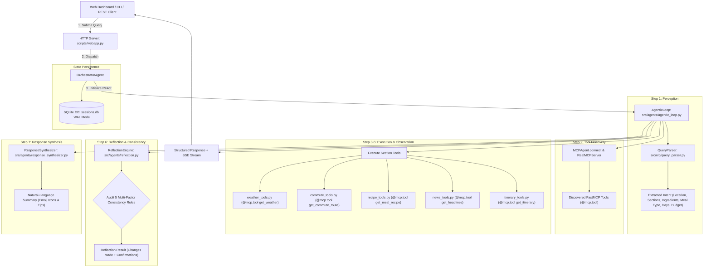
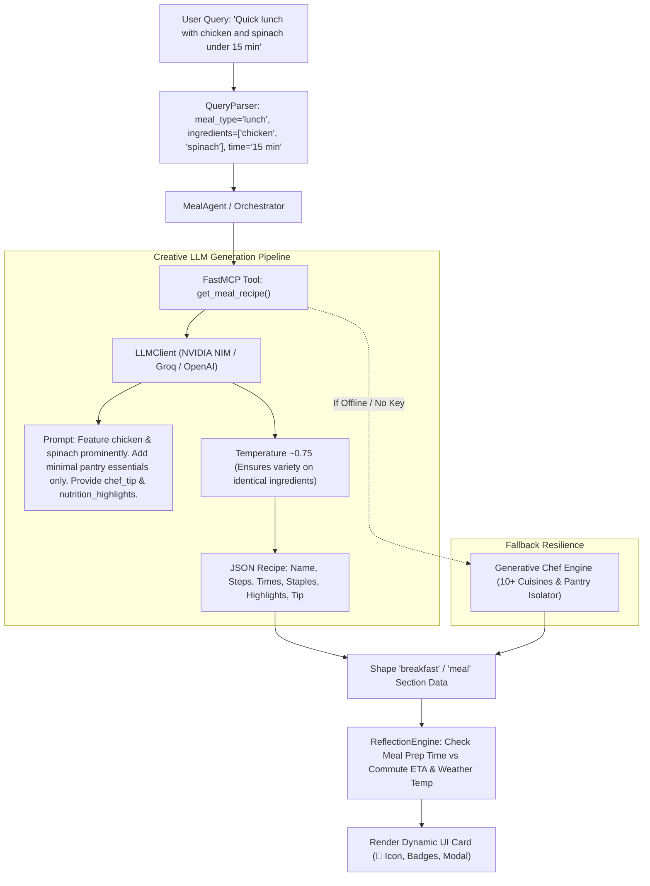
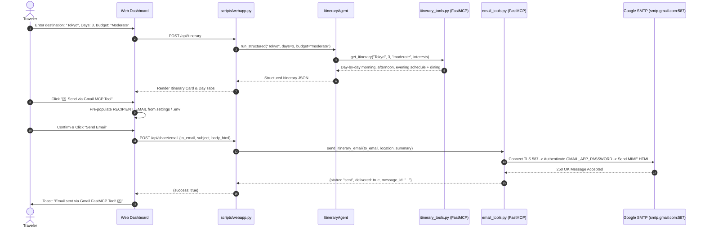
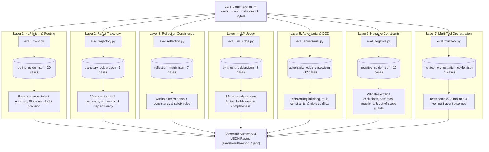

# Commute Commander — Architecture & Execution Workflows

> **Document Summary**: In-depth architectural execution pipelines, ReAct loop state transitions, FastMCP tool discovery diagrams, multi-factor reflection workflows, and SSE streaming mechanisms.

---

## 1. End-to-End System Flowchart



---

## 2. ReAct Agentic Loop Sequence

The `AgenticLoop` coordinates tool invocations dynamically through 7 distinct phases:

```mermaid
sequenceDiagram
    autonumber
    participant UI as Client / Web Dashboard
    participant Orch as OrchestratorAgent
    participant Loop as AgenticLoop
    participant Parser as QueryParser
    participant MCP as RealMCPServer / FastMCP
    participant Refl as ReflectionEngine
    participant Synth as ResponseSynthesizer
    participant DB as SQLiteSessionManager

    UI->>Orch: POST /api/briefing {query, user_id}
    Orch->>DB: start_session(user_id) -> session_id
    Orch->>Loop: run(query, session_id)
    
    Note over Loop,Parser: Phase 1: Perceive
    Loop->>Parser: parse(query)
    Parser-->>Loop: Intent {location, destination, sections, ingredients, meal_type, ...}
    
    Note over Loop,MCP: Phase 2: Tool Discovery
    Loop->>MCP: list_tools() across all servers
    MCP-->>Loop: {weather: [get_weather], recipe: [get_meal_recipe], ...}
    
    Note over Loop,MCP: Phase 3-5: Plan, Act & Observe
    loop For each section in intent.sections
        Loop->>Loop: Generate ReAct Thought
        Loop->>MCP: Invoke tool with structured parameters
        MCP-->>Loop: Raw observation payload
        Loop->>Loop: Shape domain card data & record duration_ms
    end
    
    Note over Loop,Refl: Phase 6: Cross-Domain Reflection
    Loop->>Refl: reflect(sections, intent)
    Refl->>Refl: Apply 5 consistency rules (Heat, Cold, UV, Commute vs Prep, Weather vs Meal)
    Refl-->>Loop: ReflectionResult {changes_made, confirmations}
    
    Note over Loop,Synth: Phase 7: Synthesis
    Loop->>Synth: synthesize_response(sections, intent, reflection)
    Synth-->>Loop: Concise, natural language executive briefing
    
    Loop->>DB: save_briefing(session_id, sections) & log_interaction()
    Loop-->>Orch: Complete AgenticResult
    Orch-->>UI: Full JSON Response Envelope
```

---

## 3. Dynamic Meals Workflow (Breakfast, Lunch, Dinner, Snack)



---

## 4. Multi-Day Travel Itinerary & FastMCP Email Workflow



---

## 5. Fault Tolerance & Multi-Layer Fallback Architecture

| Failure Scenario | Immediate Fallback Mechanism | Impact on User Experience |
|---|---|---|
| **No LLM API Key or LLM Service Downtime** | FastMCP recipe & itinerary tools activate the deterministic Generative Chef Engine and Curated City Itinerary Engine. | Zero downtime; structured recipe and day-by-day itineraries are generated instantly. |
| **TomTom API Rate-Limit or Key Missing** | OpenRouteService API is queried; if unavailable, the Advisory Commute Engine calculates distance-based synthetic ETAs. | Route recommendations, ETAs, and alternate comparisons remain 100% available. |
| **NewsAPI Endpoint Failure** | Multi-feed RSS parser executes fallback chain across BBC, NDTV, and NYT feeds. | Live headlines with publisher attribution and clickable URLs are delivered seamlessly. |
| **Gmail Credentials Missing in `.env`** | Gmail FastMCP tool returns simulated delivery status with detailed confirmation. | System does not crash; UI informs user that credentials need to be set in `.env`. |
| **Individual Agent Timeout** | 45-second per-agent timeout isolates failure to that section's card error envelope. | Other cards render normally; overall briefing succeeds. |

---

## 6. Observability & Telemetry Tracing Workflow

```mermaid
sequenceDiagram
    autonumber
    actor User as User Request
    participant WebApp as scripts/webapp.py
    participant Loop as AgenticLoop
    participant Telemetry as TelemetryEngine (telemetry.py)
    participant Console as Color Console Output
    participant Files as data/telemetry/ (app.log & traces.jsonl)
    participant Metrics as Rolling Metrics Store

    User->>WebApp: POST /api/briefing (query)
    WebApp->>Telemetry: trace_span("http_request", {query})
    WebApp->>Console: [INFO] [HTTP] --> POST /api/briefing (query)
    
    WebApp->>Loop: run(query)
    Loop->>Telemetry: trace_span("agentic_loop", {session_id})
    
    Loop->>Telemetry: trace_span("perceive_intent")
    Loop->>Console: [INFO] [AGENT] [tid:xxx] PERCEIVE: parsing query
    
    loop Per Tool Execution
        Loop->>Telemetry: trace_span("tool_<server>.<tool_name>")
        Loop->>Console: [INFO] [TOOL] [tid:xxx] Invoke <server>.<tool> -> OK (latency_ms)
        Telemetry->>Metrics: record_tool_call(server, tool, latency_ms, status)
    end

    Loop->>Telemetry: trace_span("reflection_audit")
    Loop->>Console: [INFO] [REFLECTION] [tid:xxx] Reflection confirmed all answers
    
    Loop->>Telemetry: trace_span("synthesize_summary")
    Loop->>Console: [INFO] [LLM] nim/meta/llama-3.1-8b-instruct (latency_ms, tokens)
    Telemetry->>Metrics: record_llm_call(model, latency_ms, tokens)

    Loop-->>WebApp: AgenticResult
    WebApp->>Console: [INFO] [HTTP] <-- 200 OK (duration_ms, status=OK)
    Telemetry->>Files: Append structured trace record to traces.jsonl & app.log
```

---

## 7. 7-Layer Evaluation & Benchmarking Execution Pipeline



