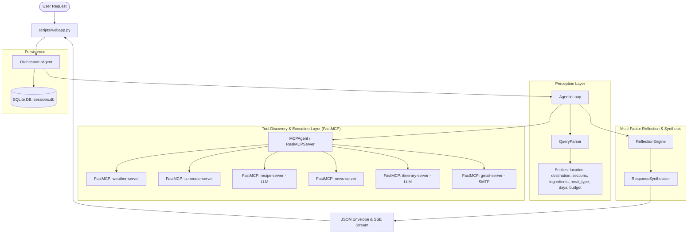

# Commute Commander — Technical Project Documentation

> **Comprehensive Engineering & Architecture Specification**  
> **System Architecture**: ReAct Multi-Agent Coordination with Model Context Protocol (FastMCP) Tool Mesh  
> **Test Status**: 62 Passed / 0 Failed (100% Automated Test Coverage)

---

## 1. System Overview & Problem Statement

Modern individuals begin their day needing to synthesize disparate, critical information: local meteorological conditions, traffic delays across multiple transit modalities, breaking news updates, meal planning based on available pantry ingredients, and multi-day travel schedules.

**Commute Commander** solves this cognitive overhead by acting as an autonomous multi-agent daily commander. The system ingests natural-language queries, autonomously perceives intent, dynamically discovers available Model Context Protocol (FastMCP) tools, orchestrates specialist agents through a ReAct loop, performs multi-factor consistency reflection, and outputs both progressive card updates via Server-Sent Events (SSE) and conversational natural-language executive summaries.

---

## 2. Complete Phase Roadmap & Evolution

```
┌──────────────┐     ┌──────────────┐     ┌──────────────┐     ┌──────────────┐
│   PHASE 1    │ ──> │   PHASE 2    │ ──> │   PHASE 3    │ ──> │   PHASE 4    │
│  CLI Core    │     │ Structured   │     │ Persistence  │     │ Real Routing │
│  & Agents    │     │ REST API     │     │ & Intent     │     │ & Leaflet    │
└──────────────┘     └──────────────┘     └──────────────┘     └──────────────┘
       │
       ▼
┌──────────────┐     ┌──────────────┐     ┌──────────────┐     ┌──────────────┐
│   PHASE 5    │ ──> │   PHASE 6    │ ──> │   PHASE 7    │ ──> │   PHASE 8    │
│  Real-Time   │     │ SQLite WAL   │     │ Settings     │     │ ReAct Loop & │
│  SSE Stream  │     │ Database     │     │ Engine       │     │ Reflection   │
└──────────────┘     └──────────────┘     └──────────────┘     └──────────────┘
       │
       ▼
┌─────────────────────────────────────────────────────────────────────────────┐
│                                   PHASE 9                                   │
│    Dynamic LLM Meals Agent (Breakfast, Lunch, Dinner, Snack), Travel       │
│        Itinerary Planner & Gmail FastMCP Tool Server (Complete)            │
└─────────────────────────────────────────────────────────────────────────────┘
```

### Phase 1: Core CLI & Specialist Agents
- Implemented high-speed `QueryParser` in `src/nlp/query_parser.py` using regex and boundary tokens (zero ML runtime dependency).
- Created domain specialist agents: `WeatherAgent`, `NewsAgent`, `CommuteAgent`, `MealAgent`.
- Implemented `OrchestratorAgent.run()` managing sequential agent execution for CLI output.

### Phase 2: Structured REST API & Web Dashboard
- Implemented `run_structured()` across all agents returning standardized JSON envelopes.
- Created `scripts/webapp.py` providing a lightweight HTTP server with zero third-party web frameworks.
- Created responsive web dashboard in `frontend/` with lavender/navy/pink glassmorphism design.

### Phase 3: State Management & Intent Persistence
- Implemented `save_intent()` and `get_intent()` enabling session recovery across server restarts.
- Added session modification and rerun endpoints: `POST /api/briefing/{id}/save`, `POST /api/briefing/{id}/rerun`, `PATCH /api/briefing/{id}/intent`.
- Added timeline history retrieval endpoint: `GET /api/history`.

### Phase 4: Multi-Modal Routing & Interactive Leaflet Maps
- Integrated TomTom Geocoding and Routing APIs with OpenRouteService fallback.
- Added decoded polyline generation for drive, bike, and walk modes.
- Embedded Leaflet 1.9.4 map in `frontend/app.js` rendering interactive routes, origin/destination pins, and alternate routes.

### Phase 5: Progressive Real-Time SSE Streaming
- Implemented `GET /api/briefing/{id}/stream` (Server-Sent Events).
- Spawned daemon threads per agent section; pushed individual JSON section payloads progressively as each agent finished.

### Phase 6: SQLite WAL Storage Engine
- Replaced JSON file storage with `SQLiteSessionManager` (`src/services/session_manager.py`).
- Implemented Write-Ahead Logging (WAL) mode for concurrency, crash resilience, and ACID compliance.

### Phase 7: Application Settings & Preferences
- Implemented `SettingsManager` (`src/services/settings_manager.py`) persisting user defaults (`default_location`, `units`, `default_sections`, `news_categories`).
- Added `GET /api/settings` and `PUT /api/settings` REST endpoints.

### Phase 8: ReAct Agentic Loop, Reflection & Synthesis
- Built `AgenticLoop` (`src/agents/agentic_loop.py`) implementing formal ReAct steps: Perceive → Discover → Plan → Act → Observe → Decide → Reflect → Synthesize.
- Implemented `ReflectionEngine` (`src/agents/reflection.py`) verifying cross-domain consistency rules.
- Implemented `ResponseSynthesizer` (`src/agents/response_synthesizer.py`) generating natural-language executive summaries.

### Phase 9: Dynamic LLM Meals Agent, Travel Itinerary & Gmail FastMCP Tool
- **Dynamic Meals Agent** (`src/agents/breakfast_agent.py` & `src/mcp_tools/recipe_tools.py`):
  - Added support for Breakfast, Lunch, Dinner, and Snacks.
  - Connected FastMCP tool `get_meal_recipe()` to `LLMClient` (NVIDIA NIM / Groq / OpenAI) with creative temperature (~0.75) for non-repeating dishes.
  - Strict user-provided ingredient enforcement with minimal pantry additions.
- **Travel Itinerary Planner** (`src/agents/itinerary_agent.py` & `src/mcp_tools/itinerary_tools.py`):
  - Multi-day day-by-day scheduling with morning, afternoon, evening activities, dining, and budget options.
- **Gmail FastMCP Tool Server** (`src/mcp_tools/email_tools.py`):
  - FastMCP tool server registering `@mcp.tool send_email_briefing` and `@mcp.tool send_itinerary_email` via standard SMTP.

---

## 3. Detailed Component Architecture



---

## 4. Autonomous Specialist Agents

### 4.1 WeatherAgent (`src/agents/weather_agent.py`)
- **Domain**: Real-time meteorological forecasting and solar radiation indices.
- **Inputs**: `location: str`.
- **Output Schema**:
  ```json
  {
    "city": "Chicago",
    "temp": 22,
    "high": 25,
    "low": 18,
    "condition": "Partly Cloudy",
    "uv_index": 5.4,
    "uv_label": "Moderate",
    "hourly": [{"time": "06:00", "temp": 18, "uv": 0.1}, ...]
  }
  ```

### 4.2 CommuteAgent (`src/agents/commute_agent.py`)
- **Domain**: Multi-modal navigation, geocoding, ETA calculation, and traffic delay detection.
- **Inputs**: `location: str` (origin), `destination: str`.
- **Modes**: `drive`, `transit`, `bike`, `walk`.
- **Output Schema**:
  ```json
  {
    "origin": {"label": "Mumbai", "lat": 19.076, "lon": 72.877},
    "dest": {"label": "BKC", "lat": 19.066, "lon": 72.868},
    "recommended_mode": "drive",
    "eta_minutes": 28,
    "distance_km": 11.4,
    "polyline": [[19.076, 72.877], [19.071, 72.872], ...],
    "alternates": [{"mode": "bike", "eta_minutes": 35, "distance_km": 10.8}],
    "alerts": ["Heavy traffic delay: +8 min on Western Express Highway"]
  }
  ```

### 4.3 MealAgent (`src/agents/breakfast_agent.py`)
- **Domain**: Personalized, dynamic culinary dish planning across Breakfast, Lunch, Dinner, and Snacks.
- **Inputs**: `ingredients: list[str]`, `time_constraint: str`, `meal_type: str`.
- **Output Schema**:
  ```json
  {
    "name": "Pan-Seared Lemon Herb Salmon with Crispy Spinach",
    "recipe_name": "Pan-Seared Lemon Herb Salmon with Crispy Spinach",
    "meal_type": "dinner",
    "prep_time_minutes": 10,
    "cook_time_minutes": 10,
    "total_time_minutes": 20,
    "ingredients_used": ["salmon fillet", "fresh spinach"],
    "pantry_staples": ["1 tbsp olive oil", "1 lemon", "2 cloves garlic", "salt", "black pepper"],
    "steps": [
      "Season salmon with salt, black pepper, and minced garlic.",
      "Heat olive oil in a skillet over medium-high heat.",
      "Sear salmon for 4 minutes per side with a squeeze of fresh lemon.",
      "Sauté spinach in remaining pan juices for 1 minute.",
      "Plate salmon over spinach and serve hot."
    ],
    "nutrition_highlights": "34g Protein · Rich in Omega-3 · Low Carb",
    "chef_tip": "Do not move salmon while searing to achieve a golden crust.",
    "category": "Quick Dinner",
    "area": "Mediterranean"
  }
  ```

### 4.4 NewsAgent (`src/agents/news_agent.py`)
- **Domain**: Global and local journalistic intelligence.
- **Output Schema**:
  ```json
  {
    "headlines": [
      {
        "title": "Global Tech Summit Announces New Open Standards for AI Protocols",
        "source": "BBC News",
        "url": "https://bbc.com/news/technology-12345",
        "published_at": "2026-08-17T14:30:00Z"
      }
    ]
  }
  ```

### 4.5 ItineraryAgent (`src/agents/itinerary_agent.py`)
- **Domain**: Multi-day personalized travel scheduling.
- **Inputs**: `location: str`, `days: int`, `budget: str`, `interests: list[str]`.
- **Output Schema**:
  ```json
  {
    "location": "Paris, France",
    "days_count": 3,
    "budget": "moderate",
    "estimated_cost": "$120 - $180 / day",
    "days": [
      {
        "day_number": 1,
        "theme": "Historic Heart & River Seine",
        "morning": {"activity": "Explore Notre-Dame Cathedral", "location": "Île de la Cité", "time": "09:00 - 11:30 AM"},
        "afternoon": {"activity": "Visit the Louvre Museum", "location": "Rue de Rivoli", "time": "01:00 - 04:30 PM"},
        "evening": {"activity": "Sunset cruise along the Seine", "location": "Pont Neuf", "time": "06:00 - 08:00 PM"},
        "dining": {"lunch": "Classic Croque Monsieur at Café de Flore", "dinner": "Traditional Duck Confit at Le Petit Châtelet"}
      }
    ],
    "travel_tips": ["Book Louvre tickets online in advance to skip the main queue."]
  }
  ```

---

## 5. Model Context Protocol (FastMCP) Layer

FastMCP provides protocol-standardized tool registration, discovery, and execution. Each tool server is implemented with the official `@mcp.tool` decorator:

| Tool Server | Registered Tools | Functionality |
|---|---|---|
| `FastMCP("weather-server")` | `get_weather(location)` | Geocodes city, fetches hourly temperature and UV forecast |
| `FastMCP("commute-server")` | `get_commute_route(origin, dest, mode)`, `get_commute_advice(location, dest)` | Computes multi-modal transit ETAs, polylines, and traffic delays |
| `FastMCP("recipe-server")` | `get_meal_recipe(ingredients, time_constraint, meal_type)`, `get_recipe(ingredients, time_constraint)` | Prompts LLM for personalized recipes or activates generative chef engine |
| `FastMCP("news-server")` | `get_headlines(category)` | Retrieves top news headlines via NewsAPI / RSS feeds |
| `FastMCP("itinerary-server")` | `get_itinerary(location, days, budget, interests)` | Generates structured multi-day travel schedules |
| `FastMCP("gmail-server")` | `send_email_briefing(to_email, subject, body_html)`, `send_itinerary_email(to_email, location, itinerary_summary)` | Dispatches emails via TLS SMTP using `.env` credentials |

---

## 6. Multi-Factor Reflection Engine

The `ReflectionEngine` (`src/agents/reflection.py`) executes a cross-section consistency audit over gathered data before the final response is synthesized:

```
Gathered Data (Weather + Commute + Meal + News)
                    │
                    ▼
┌─────────────────────────────────────────────────────────────┐
│ 1. Heat & Commute Rule: temp ≥ 35°C + bike/walk             │
│    → Switch to 'drive', add extreme heat safety alert       │
│                                                             │
│ 2. Cold Weather Rule: temp ≤ 2°C + walk/bike                │
│    → Add freezing road and walkway safety alert             │
│                                                             │
│ 3. Solar Radiation Rule: uv_index ≥ 8 + bike/walk           │
│    → Add high UV sun protection advisory                    │
│                                                             │
│ 4. Schedule Balance Rule: commute ≥ 45m + meal_prep ≥ 15m   │
│    → Add recommendation for 10-minute quick meal            │
│                                                             │
│ 5. Meal & Climate Rule: temp ≥ 30°C + hot meal              │
│    → Recommend chilled / refreshing option                  │
│    temp ≤ 5°C + cold salad → Recommend warm comfort dish    │
└─────────────────────────────────────────────────────────────┘
                    │
                    ▼
   ReflectionResult(changes_made, confirmations)
```

---

## 7. Database Persistence Layer (SQLite WAL)

`SQLiteSessionManager` manages persistent state in `data/sessions.db` using SQLite Write-Ahead Logging (WAL) for high-performance concurrent reads and writes:

### Schema Definition:
```sql
CREATE TABLE IF NOT EXISTS sessions (
    session_id    TEXT PRIMARY KEY,
    user_id       TEXT NOT NULL,
    created_at    TEXT NOT NULL,
    saved         INTEGER NOT NULL DEFAULT 0,
    saved_at      TEXT,
    intent        TEXT,            -- JSON Blob
    last_sections TEXT             -- JSON Blob
);

CREATE TABLE IF NOT EXISTS interactions (
    id            INTEGER PRIMARY KEY AUTOINCREMENT,
    session_id    TEXT NOT NULL,
    data          TEXT NOT NULL,    -- JSON Blob
    timestamp     TEXT NOT NULL,
    FOREIGN KEY(session_id) REFERENCES sessions(session_id)
);
```

---

---

## 8. Observability, Telemetry & Logging Subsystem

The observability engine (`src/services/telemetry.py`) provides end-to-end operational visibility, real-time metrics aggregation, and OpenTelemetry-aligned span tracing.

### 8.1 Dual-Mode Structured Logger
- **Console Mode**: Real-time ANSI color-coded formatting displaying timestamps, log levels (`[INFO]`, `[WARN]`, `[ERROR]`), agent tags (`[AGENT]`, `[TOOL]`, `[LLM]`, `[REFLECTION]`), and trace identifiers (`[tid:xyz]`).
- **File Persistence**: Dual persistence to human-readable log records in `data/telemetry/app.log` and structured JSONL format in `data/telemetry/traces.jsonl`.

### 8.2 Execution Trace Spans & Waterfall Profiling
The `trace_span(name, attributes)` context manager profiles every discrete sub-operation in the ReAct lifecycle:
- `perceive_intent`: Query parsing latency & extracted entity counts.
- `tool_discovery`: FastMCP server connection & tool registry enumeration.
- `tool_<server>.<tool_name>`: Duration, invocation status (`OK`/`ERROR`), arguments, and payload size.
- `llm_call`: Latency profiling, token usage counts, and model metadata.
- `reflection_audit`: Multi-rule consistency evaluation duration and override tracking.
- `synthesize_summary`: Natural language briefing composition latency.

### 8.3 Rolling Metrics Aggregation & Observability REST APIs
- `GET /api/observability/metrics`: Returns total request count, tool calls per server, latency percentiles (P50, P95), average LLM response latency, total tokens consumed, and error rates.
- `GET /api/observability/traces`: Returns the 50 most recent execution traces with step counts, total durations, and status codes.
- `GET /api/observability/traces/<trace_id>`: Returns granular waterfall spans and event timelines for a given trace.

---

## 9. 7-Layer Comprehensive Evaluation & Benchmarking Suite

The project includes an enterprise-grade evaluation suite (`evals/`) covering 7 testing dimensions with dedicated golden datasets, evaluators, unified CLI runner, and CI regression tests:

```
┌────────────────────────────────────────────────────────────────────────┐
│                   COMMUTE COMMANDER EVALUATION SUITE                   │
├────────────────────────────────────────────────────────────────────────┤
│ Layer 7: Complex Multi-Tool Orchestration (eval_multitool.py)          │
│ Layer 6: Negative Constraints & Excluded Tools (eval_negative.py)      │
│ Layer 5: Adversarial & Edge-Case Benchmark (eval_adversarial.py)       │
│ Layer 4: Output Quality & Faithfulness Judge (eval_llm_judge.py)       │
│ Layer 3: Cross-Domain Reflection Matrix Benchmark (eval_reflection.py) │
│ Layer 2: ReAct Trajectory & Tool Call Validation (eval_trajectory.py)  │
│ Layer 1: NLP Intent Classification & Slot Benchmark (eval_intent.py)   │
└────────────────────────────────────────────────────────────────────────┘
```

### Layer Breakdown & Metrics

| Layer | Benchmark Evaluator | Golden Dataset | Scope & Assertions | Benchmark Score |
|---|---|---|---|---|
| **1. Intent & Routing** | `eval_intent.py` | `routing_golden.json` (20 cases) | Single & compound section routing, slot extraction accuracy (cities, ingredients, times). | **100.0% Acc (F1: 1.00)** |
| **2. Agent Trajectory** | `eval_trajectory.py` | `trajectory_golden.json` (6 cases) | Tool call selection accuracy, execution order validation, step efficiency bounds ($\le 7$ steps). | **100.0% Tool Acc (100% Eff)** |
| **3. Reflection Matrix** | `eval_reflection.py` | `reflection_matrix.json` (7 cases) | Cross-domain multi-factor rule consistency (Heat vs Bike, Cold, UV Index, Prep vs Commute, Climate Meals). | **100.0% Pass (7/7)** |
| **4. Quality & Judge** | `eval_llm_judge.py` | `synthesis_golden.json` (3 cases) | LLM-as-a-judge evaluating factual faithfulness, completeness, formatting quality, and hallucination absence. | **4.3 / 5.0 Faithful Score** |
| **5. Adversarial & OOD** | `eval_adversarial.py` | `adversarial_edge_cases.json` & `extreme_reflection_matrix.json` (12 cases) | Colloquial slang ("tube", "umbrella weather"), multi-constraint recipe dumps, compound extreme conditions (Heat 42°C + UV 11.5 + Bike). | **100.0% Pass (NLP: 100%)** |
| **6. Negative Constraints** | `eval_negative.py` | `negative_golden.json` (10 cases) | Explicit exclusions ("do not give commute", "skip news"), past temporal negations ("already ate breakfast"), out-of-scope queries ("write python code", "translate"). | **100.0% Pass (10/10)** |
| **7. Multi-Tool Orch** | `eval_multitool.py` | `multitool_orchestration_golden.json` (5 cases) | Complex 3-tool and 4-tool multi-agent pipelines (Weather + Commute + News + Recipe / Itinerary), step bounds, and state consistency. | **100.0% Pass (5/5)** |

---

## 10. Verification & Test Coverage

All modules are continuously verified via `pytest`. The test suite contains **69 unit, integration, and eval regression tests**:

| Test Module | Coverage Area | Tests | Status |
|---|---|---|---|
| `test_agentic_loop.py` | ReAct state transitions, tool discovery, trace logging | 18 | ✅ Passed |
| `test_meal_agent.py` | Breakfast, lunch, dinner dynamic generation, pantry constraints | 7 | ✅ Passed |
| `test_itinerary.py` | Multi-day travel scheduling, presets, orchestrator dispatch | 5 | ✅ Passed |
| `test_email_tools.py` | FastMCP email tools and SMTP dispatch | 3 | ✅ Passed |
| `test_llm_client.py` | Multi-provider LLM API client and configuration | 3 | ✅ Passed |
| `test_query_parser.py` | NLP entity extraction (meals, travel, locations, times) | 3 | ✅ Passed |
| `test_reflection.py` | Multi-factor reflection consistency rules | 10 | ✅ Passed |
| `test_phase6_7.py` | SQLiteSessionManager & SettingsManager persistence | 11 | ✅ Passed |
| `test_session_logging.py`| SQLite session transactions and history clearing | 2 | ✅ Passed |
| `test_evals_regression.py` | 7-Layer Evaluation Suite automated regression benchmark | 7 | ✅ Passed |
| **Total** | **Complete System Automated Verification** | **69** | **100% Passed** |

---

## 9. Future Scope & Strategic Roadmap

The architecture of Commute Commander is designed with modular extensibility. The following strategic phases represent the upcoming roadmap:

```
┌─────────────────────────────────────────────────────────────────────────────┐
│                           STRATEGIC FUTURE ROADMAP                          │
├─────────────────────────┬─────────────────────────┬─────────────────────────┤
│  PHASE 10: VOICE & AUDIO│  PHASE 11: PWA & MOBILE │  PHASE 12: CALENDAR MCP │
│  • Web Speech API Input │  • Service Worker Cache │  • Google Calendar Tool │
│  • ElevenLabs / TTS Play│  • Push Notifications   │  • Meeting-Aware Commute│
│  • Hands-Free Car Mode  │  • Installable App Icon │  • Auto-Agenda Sync     │
├─────────────────────────┼─────────────────────────┼─────────────────────────┤
│  PHASE 13: SMART HOME   │  PHASE 14: MEMORY GRAPH │  PHASE 15: MULTI-MODAL  │
│  • Home Assistant / MQTT│  • Long-Term Memory     │  • Vision & Fridge Scan │
│  • Smart Thermostat Sync│  • Habit Learning       │  • OCR Ticket Scanner   │
│  • Connected Appliances │  • Anomaly Detection    │  • Image-to-Itinerary   │
└─────────────────────────┴─────────────────────────┴─────────────────────────┘
```

### 9.1 Phase 10: Multi-Modal Voice Interface & Audio Briefings
- **Speech-to-Text (STT)**: Integration of browser-native Web Speech API and Whisper API for zero-friction, hands-free voice query input during the morning routine.
- **Natural Text-to-Speech (TTS)**: Integration of high-fidelity neural audio generation (ElevenLabs / Edge TTS) to synthesize conversational audio briefings that users can listen to while preparing for work or driving.
- **Interactive Audio Controls**: Visual audio wave animation, play/pause controls, and segment skipping directly within the web dashboard.

### 9.2 Phase 11: Progressive Web Application (PWA) & Mobile Experience
- **Offline Service Worker Support**: Caching of historical briefings, saved travel itineraries, and map tiles for offline access during subway or flight transit.
- **Scheduled Web Push Notifications**: Automated morning briefing alerts delivered at user-configured times (e.g., 07:00 AM) based on local traffic and weather triggers.
- **Mobile Touch Enhancements**: Swipeable itinerary day cards, bottom sheet modal views, and native share sheet integration.

### 9.3 Phase 12: Calendar & Productivity Tool Mesh
- **FastMCP Calendar Server**: Dedicated `@mcp.tool` server interfacing with Google Calendar API and Microsoft Graph API.
- **Schedule-Aware Commute Routing**: Dynamic departure time calculation that cross-references the user's first daily meeting location against live traffic congestion.
- **One-Click Itinerary Export**: Automatic generation of Google Calendar timeblocks and Notion travel planner database pages from synthesized itineraries.

### 9.4 Phase 13: Smart Home & IoT Automation (Home Assistant / Matter)
- **Morning Routine Automation**: Dispatching briefing triggers over MQTT or REST to Home Assistant, activating ambient lighting and adjusting smart thermostats based on the weather forecast.
- **Smart Appliance Integration**: Direct signaling to smart kitchen appliances (e.g., preheating smart ovens or setting smart coffee machines based on the selected meal prep time).

### 9.5 Phase 14: Long-Term Episodic Memory & Predictive Intelligence
- **Personalized Memory Graph**: Secure, local vector storage of user habits (dietary restrictions, preferred transit modes, budget preferences, frequent destinations).
- **Proactive Traffic Anomalies**: Background cron monitoring that detects uncharacteristic traffic delays along frequent commute corridors and alerts the user prior to their scheduled departure.

### 9.6 Phase 15: Computer Vision & Multi-Modal Input
- **Fridge & Pantry Image Scanning**: Multi-modal vision agent that analyzes photos of user refrigerators or pantries to automatically extract available ingredients for the MealAgent.
- **Transit Ticket & Boarding Pass OCR**: Visual scanning of flight or train tickets to automatically populate destination, travel dates, and itinerary parameters.

